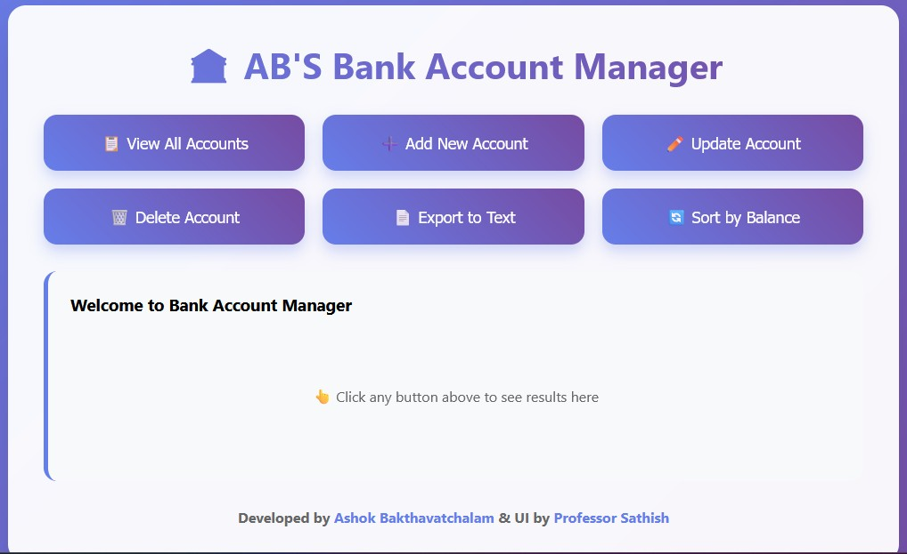

# 🏦 AB'S Bank Account Manager

A full-stack bank account management system with a modern web interface built using Flask (Python) backend and a C program for core banking operations. Features a beautiful, responsive UI with real-time account management capabilities.



## ✨ Features

- **📋 View All Accounts** - Display all bank accounts in a clean, organized table
- **➕ Add New Account** - Create new customer accounts with validation
- **✏️ Update Account** - Process transactions (charges and payments)
- **🗑️ Delete Account** - Remove accounts with confirmation prompts
- **📄 Export to Text** - Export account data to text files
- **🔄 Sort by Balance** - View accounts ranked by balance (highest to lowest)
- **🎨 Modern UI** - Beautiful gradient design with smooth animations
- **📱 Responsive Design** - Works seamlessly on desktop and mobile devices

## 🏗️ Architecture

### Backend Components
- **Flask Web Server** (`app.py`) - REST API and web interface
- **C Banking Program** (`bank_program`) - Core banking operations executable
- **Binary Data Storage** (`credit.dat`) - Account data stored in binary format

### Frontend
- **Pure HTML/CSS/JavaScript** - No external dependencies
- **Modern CSS Features** - Gradients, animations, responsive grid
- **AJAX Communication** - Seamless API interactions

## 📋 Prerequisites

### System Requirements
- **Python 3.7+**
- **GCC Compiler** (for compiling C program)
- **WSL** (Windows Subsystem for Linux) - if running on Windows

### Dependencies
Install Python dependencies:
```bash
pip install -r requirements.txt
```

## 🚀 Installation & Setup

### 1. Clone the Repository
```bash
git clone https://github.com/yourusername/bank-account-manager.git
cd bank-account-manager
```

### 2. Compile the C Program
```bash
# On Linux/WSL
gcc -o bank_program ntrans.c

# Make it executable
chmod +x bank_program
```

### 3. Install Python Dependencies
```bash
pip install flask
# or
pip install -r requirements.txt
```

### 4. Run the Application
```bash
python app.py
```

### 5. Access the Application
Open your web browser and navigate to:
```
http://localhost:5000
```

## 📁 Project Structure

```
bank-account-manager/
├── app.py                 # Flask web application
├── bank_program          # Compiled C executable
├── ntrans.c              # C source code for banking operations
├── credit.dat            # Binary data file (auto-generated)
├── accounts.txt          # Text export file (auto-generated)
├── requirements.txt      # Python dependencies
├── README.md            # This file
└── screenshot.png       # UI screenshot
```

## 🔧 API Endpoints

| Method | Endpoint | Description |
|--------|----------|-------------|
| `GET` | `/` | Main web interface |
| `GET` | `/api/accounts` | Get all accounts |
| `POST` | `/api/accounts/add` | Add new account |
| `POST` | `/api/accounts/update` | Update account balance |
| `POST` | `/api/accounts/delete` | Delete account |
| `POST` | `/api/accounts/export` | Export to text file |
| `POST` | `/api/accounts/sort` | Sort accounts by balance |
| `GET` | `/api/test` | Test C program connectivity |

## 💡 Usage Examples

### Adding a New Account
1. Click "➕ Add New Account"
2. Fill in the form:
   - Account Number: 1-100
   - Last Name: (max 14 characters)
   - First Name: (max 9 characters)
   - Initial Balance: Any decimal amount
3. Click "Add Account"

### Processing Transactions
1. Click "✏️ Update Account"
2. Enter account number
3. Enter transaction amount:
   - Positive values = charges/debits
   - Negative values = payments/credits
4. Click "Update Account"

### Viewing Sorted Accounts
1. Click "🔄 Sort by Balance"
2. Accounts display in descending order by balance
3. Each account shows its ranking position

## 🛠️ Technical Details

### Data Storage
- **Binary Format**: Accounts stored in `credit.dat` using C struct format
- **Record Size**: 40 bytes per account
- **Fields**: Account Number (4 bytes), Last Name (15 bytes), First Name (10 bytes), Balance (8 bytes), Padding (3 bytes)

### C Program Integration
- **Subprocess Communication**: Flask communicates with C program via stdin/stdout
- **Command Interface**: Menu-driven C program with numbered options
- **Error Handling**: Robust error handling for process communication
- **Encoding Support**: UTF-8 and Latin-1 encoding fallback

### Security Features
- **Input Validation**: All user inputs validated before processing
- **Confirmation Dialogs**: Delete operations require confirmation
- **Error Handling**: Comprehensive error messages and graceful failures
- **Subprocess Isolation**: C program runs in isolated subprocess

## 🎨 UI/UX Features

- **Gradient Backgrounds**: Modern purple gradient theme
- **Smooth Animations**: CSS transitions and hover effects
- **Loading States**: Visual feedback during operations
- **Status Messages**: Success/error notifications
- **Responsive Grid**: Adaptive layout for different screen sizes
- **Form Validation**: Client-side and server-side validation

## 🧪 Testing

### Test C Program Connection
```bash
curl http://localhost:5000/api/test
```

### Test API Endpoints
```bash
# Get all accounts
curl http://localhost:5000/api/accounts

# Add account (example)
curl -X POST http://localhost:5000/api/accounts/add \
  -H "Content-Type: application/json" \
  -d '{"account_num": 1, "last_name": "Doe", "first_name": "John", "balance": 1000.50}'
```

## 🐛 Troubleshooting

### Common Issues

**C Program Not Found**
```bash
# Ensure the C program is compiled and executable
gcc -o bank_program ntrans.c
chmod +x bank_program
```

**Permission Denied**
```bash
# On WSL/Linux, ensure proper permissions
chmod +x bank_program
```

**Port Already in Use**
```bash
# Change port in app.py or kill existing process
lsof -ti:5000 | xargs kill -9
```

**Binary File Corruption**
- Delete `credit.dat` file to reset
- The application will create a new empty database

## 👥 Contributors

- **Backend Development**: [Ashok Bakthavatchalam](https://www.ashokbakthavathsalam.com/)
- **UI Design**: [Professor Sathish](https://professor-sathish.github.io/)

## 📄 License

This project is open source and available under the [MIT License](LICENSE).

## 🤝 Contributing

1. Fork the repository
2. Create a feature branch (`git checkout -b feature/amazing-feature`)
3. Commit your changes (`git commit -m 'Add amazing feature'`)
4. Push to the branch (`git push origin feature/amazing-feature`)
5. Open a Pull Request

## 📞 Support

If you encounter any issues or have questions:

1. Check the [Issues](https://github.com/yourusername/bank-account-manager/issues) page
2. Create a new issue with detailed description
3. Contact the development team

---

**⭐ If you find this project helpful, please give it a star!**
